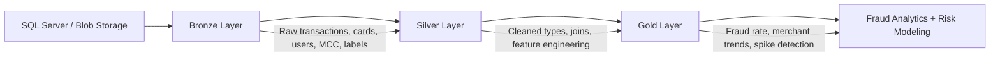

# Financial Fraud Detection System

<p align="center">
  
  
  
  
</p>

A full-stack financial fraud detection and risk analytics project built on Databricks. The system ingests transaction, card, user, and label data from SQL Server and Azure Storage, cleans and enriches it through a Medallion architecture, and produces analytics-ready Gold tables for fraud monitoring and decision support.

## Project scope and originality

This folder contains two related but intentionally separate workloads:

1. A transaction-level fraud analytics pipeline built in the Bronze → Silver → Gold pattern
2. A credit-risk modeling notebook that experiments with label engineering and a Random Forest risk classifier

These are connected by the broader financial-risk domain, but they are not copies of a second project in this workspace. A repo-level search shows no duplicate fraud project implementation elsewhere in the current repository, and the code structure is consistent with a custom Databricks implementation rather than a direct clone of another local project.

This repository combines data engineering and applied analytics to answer real business questions such as:

- Which transactions are likely fraudulent?
- Which clients or merchants exhibit suspicious behavior?
- Which time windows, merchants, and MCC categories show the highest fraud concentration?
- How do fraud patterns differ by amount, time of day, and customer profile?

## Why this project matters

Fraud detection is a classic data challenge: the signal is hidden in noisy, multi-source transactional data. This project addresses that by building a structured pipeline that transforms raw operational data into trusted analytical assets for downstream monitoring and model development.

The project follows a pragmatic data engineering pattern:

- Bronze: raw ingestion from source systems
- Silver: standardization, type cleaning, joins, and feature generation
- Gold: high-value fraud KPIs and aggregated analytical tables

## Project structure

```text
Financial Fraud Detection System/
├── Readme.md
├── Assets/
│   └── Dashboard.pdf
├── Notebook/
│   ├── 01_Bronze_fraudda_pipeline.ipynb
│   ├── 02_silver_fraudda_pipeline.ipynb
│   ├── 03_gold_fraudda_pipeline.ipynb
│   └── Financial_Risk_Classifier_V2.ipynb
└── README and notebook outputs
```

## Data sources and ingestion

The Bronze pipeline reads multiple datasets from different sources:

- SQL Server database: `frauddb`
  - `dbo.transactions_data`
  - `dbo.cards_data`
- Azure Data Lake / Storage container: `bronze-landing`
  - `users_data.csv`
  - `mcc_codes.json`
  - `train_fraud_labels.json`

The ingestion workflow creates a Unity Catalog-style project structure:

```sql
fraud_project.bronze.transactions_data
fraud_project.bronze.cards_data
fraud_project.bronze.users_data
fraud_project.bronze.mcc_codes
fraud_project.bronze.train_fraud_labels
```

## Architecture overview



## Notebook workflow

### 1) Bronze pipeline

Notebook: `01_Bronze_fraudda_pipeline.ipynb`

This notebook establishes the ingestion foundation by:

- connecting to SQL Server using JDBC
- reading raw transaction and card tables
- creating the required catalog and schemas
- writing raw data into Delta tables in the Bronze layer
- reading user CSV data from Azure Storage
- normalizing and saving the MCC code JSON into a usable table
- parsing the training fraud label JSON and saving it as a Bronze table

Key outcome:

- recoverable, source-faithful raw data is stored in Delta tables for downstream processing

### 2) Silver pipeline

Notebook: `02_silver_fraudda_pipeline.ipynb`

This notebook performs the data quality and normalization layer by:

- cleaning currency fields such as `amount`, `credit_limit`, and income columns
- converting dates to proper date types
- deriving transaction features such as:
  - day of week
  - hour of day
  - time bucket (`Morning`, `Afternoon`, `Evening`, `Night`)
  - weekend indicator
- joining transaction data with MCC metadata and fraud labels
- resolving unlabeled records as non-fraud per the project assumption
- creating curated Silver tables:
  - `fraud_project.silver.users`
  - `fraud_project.silver.cards`
  - `fraud_project.silver.transactions`

Key transformations include:

- currency parsing from values like `$1,245.10`
- `date` normalization and feature extraction
- `mcc_description` enrichment from the MCC reference table
- label alignment for fraud flag generation

### 3) Gold pipeline

Notebook: `03_gold_fraudda_pipeline.ipynb`

This notebook creates business-ready analytical tables that answer operational fraud questions. It produces tables such as:

- `fraud_by_day_of_week`
- `fraud_rate_trend`
- `top_fraud_users`
- `spending_spikes`
- `fraud_by_mcc`
- `fraud_by_merchant`
- `fraud_by_time_of_day`
- `avg_amount_fraud_vs_legit`
- `daily_fraud_losses`
- `weekly_unique_fraud_users`
- `monthly_fraud_seasonality`
- `behavior_around_fraud_event`
- `fraud_by_amount_tier`

These outputs are designed for:

- monitoring fraud concentration across time
- identifying suspicious high-amount spenders
- highlighting vulnerable merchants and MCC categories
- spotting time-of-day or day-of-week fraud patterns
- preparing analysis for fraud review teams or dashboards

## Fraud detection logic and business KPIs

The Gold layer emphasizes several operational indicators:

- fraud count by day of week
- fraud rate trend over time
- top risky users
- abnormal spend spikes relative to each client’s weekly average
- fraud rate by merchant or merchant category code
- fraud volume by amount tier
- average transaction amount for legitimate versus fraudulent transactions
- daily fraud loss exposure

## Supporting risk-classification model

Notebook: `Financial_Risk_Classifier_V2.ipynb`

This notebook is a separate but relevant analytics exercise focused on risk scoring rather than direct fraud tagging. It demonstrates a credit/risk classification workflow where the original risk label is found to be unreliable and is replaced by a logically engineered target based on credit-scoring principles.

The workflow includes:

- intelligent imputation for missing values
- feature engineering such as:
  - `Loan_to_Income`
  - `Loan_to_Assets`
  - `Disposable_Income`
  - `Defaults_Per_Year`
  - `Has_Defaults`
- FICO-style weighted scoring for a new logical risk target
- Random Forest modeling and evaluation with macro F1 scoring
- model artifact export via `joblib`

This notebook is valuable as an example of how data quality and label engineering can dramatically improve model performance in financial analytics.

## Asset folder

The project includes a dashboard artifact in the `Assets` folder:

- `Assets/Dashboard.pdf`

This likely represents a presentation or management summary built from the fraud analysis outputs, supporting executive review and operational visibility.

## Technologies used

- Databricks
- Apache Spark / PySpark
- Delta Lake
- Azure SQL Database
- Azure Data Lake Storage Gen2 / ADLS
- Python
- Pandas / NumPy
- Scikit-learn
- Matplotlib / Seaborn

## Expected outcomes

This project has the following value proposition:

- enables monitoring of financial fraud across customer and transaction behavior
- creates trusted enterprise-ready datasets for downstream analytics
- supports investigation workflows using merchant, amount, and temporal fraud signals
- provides a reusable pattern for Medallion-based financial data engineering
- demonstrates how model-driven analytics can complement transaction monitoring

## How to use this project

1. Open the Bronze notebook and validate the source connections.
2. Run the Bronze pipeline to ingest raw data into Delta tables.
3. Execute the Silver notebook to clean and join the datasets.
4. Run the Gold notebook to generate the analytical tables.
5. Review the dashboard artifact for a summary of business insights.
6. Optionally open the risk-model notebook for credit-risk experimentation and model engineering.

## Notes and assumptions

- Unlabeled transactions are treated as non-fraud in the Silver pipeline to keep the data operationally consistent.
- This project is designed for a Databricks environment with access to both SQL Server and Azure Storage.
- The catalog and schema names follow the project naming convention: `fraud_project.*`.

## Potential next improvements

- add real-time streaming ingestion
- implement alerting for suspicious transactions
- train a production fraud classification model on the Silver feature layer
- introduce data quality checks and expectation tests
- add dashboarding via Databricks SQL or Power BI
- integrate feature-store and model tracking workflows

## License

This project is intended for learning, analytics experimentation, and internal data engineering use unless otherwise specified.

---

<p align="center">
  <strong>Built to detect fraud before it becomes damage.</strong>
</p>
