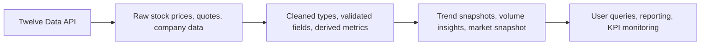

# Stock Market Data Analytics Platform

<p align="center">
  
  
  
  
</p>

A modern, production-oriented analytics pipeline for ingesting, transforming, and surfacing stock-market intelligence from the Twelve Data API using Databricks, Delta Lake, and the Medallion Architecture.

This project turns raw market data into trusted, analytics-ready layers for trend analysis, key performance monitoring, and decision support across a curated set of equities.

## Why this project matters

Financial datasets are noisy, fragmented, and often inconsistent across sources. This platform solves that by creating a clean data lifecycle:

- Bronze captures raw API responses without losing source fidelity
- Silver standardizes and validates the data into trustworthy tables
- Gold creates business-ready metrics for dashboards and analysis

The result is a reliable pipeline that makes market data easier to use, understand, and act on.

## Highlights

- Real-time and historical stock data ingestion
- Multi-layer Medallion architecture for data quality and lineage
- Trend analysis across short, medium, and long windows
- Unified snapshots for analytics dashboards and reports
- Unity Catalog governance for discoverability and access control
- Delta Lake-powered storage with scalable performance

## Architecture overview



## Data flow

```text
Twelve Data API
       │
       ▼
Bronze Layer (raw ingestion)
       │
       ▼
Silver Layer (cleaning + validation)
       │
       ▼
Gold Layer (trend aggregation + snapshot tables)
       │
       ▼
Analytics & dashboards
```

## Medallion architecture

### Bronze layer

This is the landing zone for incoming market data. It preserves the raw structure from the source API and acts as the single source of truth for downstream transformations.

| Table | Description | Notes |
| --- | --- | --- |
| `bronze_stock_prices` | Raw daily OHLCV price history | Preserves API schema |
| `bronze_stock_quotes` | Latest quote snapshot per symbol | Source-level quote data |
| `bronze_company_info` | Company profile and financial metadata | Raw company context |

### Silver layer

The Silver layer standardizes formats, fixes types, and applies quality rules to create usable business data.

| Table | Description | Typical transformations |
| --- | --- | --- |
| `silver_stock_prices` | Cleaned daily stock prices | Type casting, date formatting, change calculations |
| `silver_stock_quotes` | Cleaned quote snapshots | Numeric normalization, null handling, percent formatting |
| `silver_company_info` | Standardized company data | Field cleaning, numeric conversion, consistency checks |

### Gold layer

Gold tables are designed for analysis and consumption. These are the business-facing datasets used for trend detection and dashboarding.

| Table | Description | Use case |
| --- | --- | --- |
| `gold_price_trends` | Multi-window price movement analysis | Momentum and trend tracking |
| `gold_volume_trends` | 7/30/90-day volume comparisons | Liquidity and activity monitoring |
| `gold_latest_snapshot` | Combined quote + trend + company view | Real-time market snapshot |

## Technology stack

- Databricks Lakehouse Platform
- Apache Spark / PySpark
- Delta Lake
- Unity Catalog
- Databricks Workflows / Lakeflow-style pipelines
- Twelve Data API
- Python for orchestration and transformations

## Project structure

```text
Stock Market Data Analytics Platform/
├── README.md
├── transformations/
│   └── my_transformation.py
├── pipeline_configs/
│   └── pipeline_metadata
└── notebooks/ (optional future expansion)
```

## Pipeline configuration

- Pipeline name: `stock_dlt_pipeline`
- Target catalog: `workspace`
- Target schema: `default`
- Compute: Serverless with Photon
- Execution mode: Batch
- Storage format: Delta Lake

## Example data outputs

All datasets are published under the Unity Catalog namespace:

```sql
SELECT * FROM workspace.default.gold_latest_snapshot;
```

### Price movement analysis

```sql
SELECT
  symbol,
  datetime,
  close_price,
  price_change_30d,
  price_change_pct_30d
FROM workspace.default.gold_price_trends
WHERE price_change_pct_30d > 10
ORDER BY price_change_pct_30d DESC;
```

### Volume spike detection

```sql
SELECT
  symbol,
  datetime,
  volume,
  avg_volume_7d,
  avg_volume_30d
FROM workspace.default.gold_volume_trends
WHERE volume > avg_volume_30d * 1.5
ORDER BY datetime DESC;
```

## Getting started

### Prerequisites

- Databricks workspace access
- Unity Catalog enabled
- Twelve Data API key
- Access to the `workspace.default` schema

### Run the pipeline

1. Validate the transformation logic in a dev/test job.
2. Confirm API credentials and access permissions.
3. Trigger the Databricks pipeline.
4. Inspect Bronze, Silver, and Gold tables for freshness and correctness.
5. Query the Gold layer for dashboard or reporting use cases.

## Monitoring and quality

This pipeline is built with reliability in mind:

- Data lineage across Bronze → Silver → Gold
- Delta Lake transaction safety
- Consistent schema evolution and validation
- Easy operational inspection through Databricks UI
- Strong foundation for alerting and QA checks

## Future roadmap

### Near-term improvements
- [ ] Add data quality expectations for nulls and value ranges
- [ ] Expand the symbol universe beyond the current watchlist
- [ ] Add technical indicators such as RSI, MACD, and Bollinger Bands
- [ ] Improve operational retry logic and API error handling

### Advanced enhancements
- [ ] Real-time streaming ingestion
- [ ] Predictive model features for price forecasting
- [ ] News-based sentiment analytics
- [ ] Portfolio-level performance dashboards
- [ ] Risk metrics including volatility and Sharpe analysis

## Business value

This platform is not just a data engineering exercise — it provides a reusable foundation for:

- Market monitoring
- Trend detection
- Investment research support
- Dashboard-driven business intelligence
- Data engineering patterns for financial data pipelines

## License

This project is intended for internal or educational use unless otherwise specified.

## Contact

For questions, feedback, or collaboration opportunities, reach out at:

- mailtokaustubhpatil@gmail.com

---

<p align="center">
  <strong>Built for smarter market intelligence.</strong>
</p>
