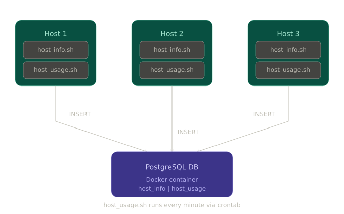

# Linux Cluster Monitoring Agent

## Introduction
The Linux Cluster Monitoring Agent is a resource monitoring solution designed for managing a cluster of Linux servers. The application collects hardware specification data and real-time resource usage data from each server in the cluster and persists it into a centralized PostgreSQL database. This allows the LCA team to monitor server performance, analyze resource utilization trends, and make informed decisions about infrastructure scaling and optimization. The primary users are system administrators and infrastructure managers who need visibility into their server cluster. The technologies used in this project include Bash scripting for data collection, PostgreSQL for data persistence, Docker for containerizing the database instance, Git for version control, and crontab for automating the data collection process.

## Quick Start

```bash
# 1. Start a psql instance using psql_docker.sh
./scripts/psql_docker.sh create db_username db_password

# 2. Create tables using ddl.sql
psql -h localhost -U postgres -d host_agent -f sql/ddl.sql

# 3. Insert hardware specs data into the DB using host_info.sh (run once per server)
./scripts/host_info.sh psql_host psql_port db_name psql_user psql_password

# 4. Insert hardware usage data into the DB using host_usage.sh
./scripts/host_usage.sh psql_host psql_port db_name psql_user psql_password

# 5. Crontab setup - collect usage data every minute
crontab -e
* * * * * bash /home/rocky/scripts/host_usage.sh localhost 5432 host_agent postgres password > /tmp/host_usage.log 2>&1
```

## Implementation

### Architecture
The diagram below shows a Linux cluster with three hosts. Each host runs the monitoring agent scripts. The agents collect data and persist it into a centralized PostgreSQL database instance running inside a Docker container on the host node.



### Scripts

- **psql_docker.sh**: Creates, starts, or stops a PostgreSQL Docker container.
```bash
./scripts/psql_docker.sh create|start|stop db_username db_password
```

- **host_info.sh**: Collects static hardware specification data and inserts it into the `host_info` table. Run once per server.
```bash
./scripts/host_info.sh psql_host psql_port db_name psql_user psql_password
```

- **host_usage.sh**: Collects dynamic CPU and memory usage data and inserts it into the `host_usage` table. Executed every minute via crontab.
```bash
./scripts/host_usage.sh psql_host psql_port db_name psql_user psql_password
```

- **crontab**: Automates the execution of `host_usage.sh` every minute to continuously collect resource usage data.
```bash
* * * * * bash /home/rocky/scripts/host_usage.sh localhost 5432 host_agent postgres password > /tmp/host_usage.log 2>&1
```

- **queries.sql**: Contains SQL queries to answer business questions such as identifying servers with low memory, detecting server failures by checking for missing data points, and analyzing CPU usage trends across the cluster over time.

### Database Modeling

#### `host_info`
| Column | Data Type | Description |
|---|---|---|
| id | SERIAL | Auto-incremented primary key |
| hostname | VARCHAR | Fully qualified hostname of the server |
| cpu_number | INT2 | Number of CPUs |
| cpu_architecture | VARCHAR | CPU architecture (e.g. x86_64) |
| cpu_model | VARCHAR | CPU model name |
| cpu_mhz | FLOAT8 | CPU speed in MHz |
| l2_cache | INT4 | L2 cache size in KB |
| timestamp | TIMESTAMP | Time when data was collected |
| total_mem | INT4 | Total memory in KB |

#### `host_usage`
| Column | Data Type | Description |
|---|---|---|
| timestamp | TIMESTAMP | Time when data was collected |
| host_id | SERIAL | Foreign key referencing host_info id |
| memory_free | INT4 | Free memory in MB |
| cpu_idle | INT2 | Percentage of CPU idle time |
| cpu_kernel | INT2 | Percentage of CPU kernel usage |
| disk_io | INT4 | Number of disk I/O operations |
| disk_available | INT4 | Available disk space in MB |

## Test
The Bash scripts and DDL were tested manually on a single Linux server instance. The `host_info.sh` script was executed once and the inserted row was verified by querying the `host_info` table directly via the psql CLI. The `host_usage.sh` script was tested by running it manually and verifying the inserted row in the `host_usage` table. The crontab automation was verified by waiting several minutes and confirming that new rows were being inserted every minute with correct timestamps.

## Deployment
The application was deployed using the following tools:
- **GitHub**: Source code is version controlled and hosted on GitHub using the Gitflow branching strategy with feature branches merged into develop.
- **Docker**: The PostgreSQL database instance is containerized using Docker, ensuring a consistent and portable database environment.
- **Crontab**: The `host_usage.sh` script is automated using Linux crontab to execute every minute and continuously collect resource usage data.

## Improvements
- Automatically detect and update hardware specification changes when a server's hardware is upgraded, rather than assuming specs are always static.
- Implement email or Slack alerts when a server's resource usage exceeds a defined threshold, enabling proactive incident response.
- Add a data retention policy to automatically archive or delete old usage records to prevent the database from growing indefinitely over time.
